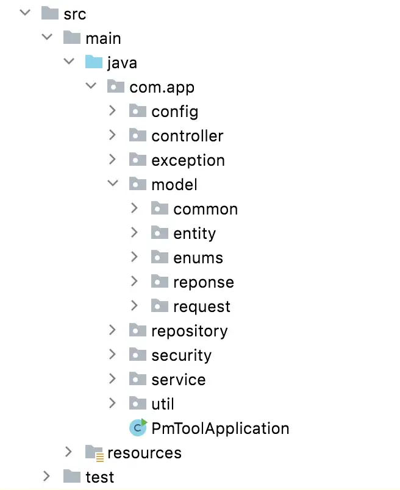
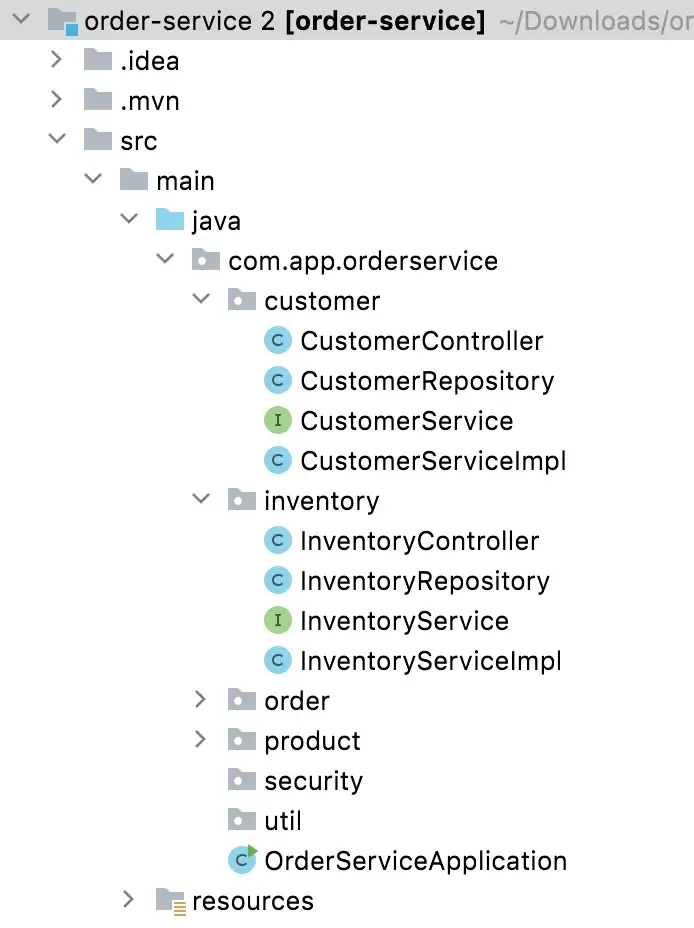
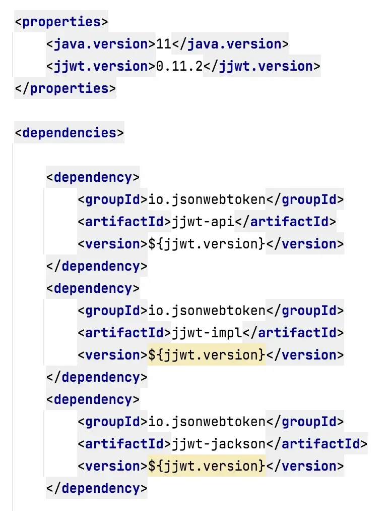
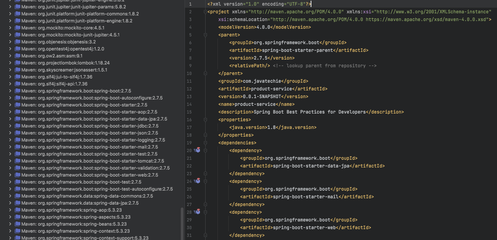
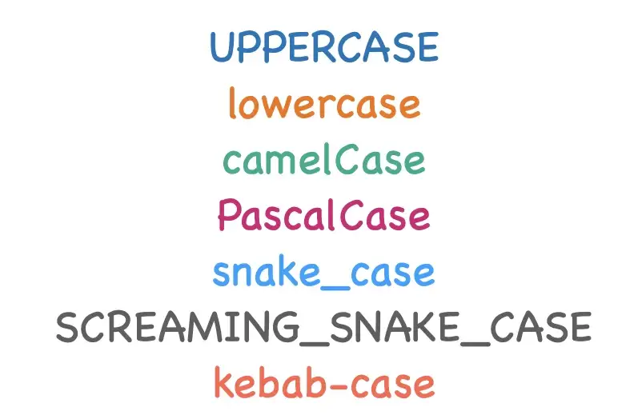
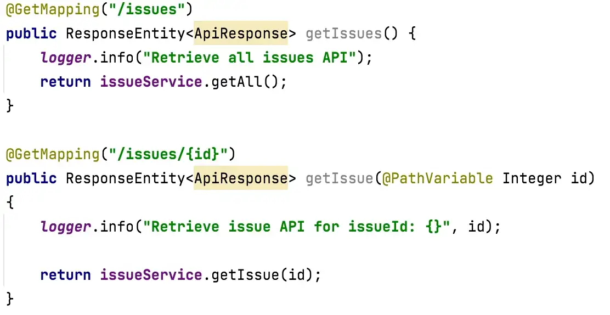

# springboot-best-practices

This tutorial is derived from: [Spring Boot Best Practices For Developers 👨‍💻 (Youtube/JavaTechie)](https://www.youtube.com/watch?v=NaEk2zAmDE8)
and [Spring Boot Best Practices for Developers (Medium/RaviYasas)](https://medium.com/@raviyasas/spring-boot-best-practices-for-developers-3f3bdffa0090)

This is a guide for best practices and includes tips which you can use to improve your Spring Boot application and make it more efficient.

## Table of Contents

[Getting Started](#getting-started)
<br>
[0. Notable Mentions](#0-notable-mentions)
<br>
[1. Proper packaging style](#1-proper-packaging-style)
<br>
[2. Use Spring Boot starters](#2-use-spring-boot-starters)
<br>
[3. Use proper versions of the dependencies](#3-use-proper-versions-of-the-dependencies)
<br>
[4. Use Lombok](#4-use-lombok)
<br>
[5. Use Controllers only for routing](#5-use-controllers-only-for-routing)
<br>
[6. Use Services for business logic](#6-use-services-for-business-logic)
<br>
[7. Use constructor injection with Lombok](#7-use-constructor-injection-with-lombok)
<br>
[8. Use Slf4j logging](#8-use-slf4j-logging)
<br>
[9. Use meaningful words for classes, methods, variables and other attributes](#9-use-meaningful-words-for-classes-methods-variables-and-other-attributes)
<br>
[10. Bean Validation](#10-bean-validation)
<br>
[11. Custom Exception Handling](#11-custom-exception-handling)
<br>
[12. Use custom response object](#12-use-custom-response-object)
<br>
[13. Use design patterns](#13-use-design-patterns)
<br>
[14. Use yml instead of properties](#14-use-yml-instead-of-properties)
<br>
[15. Encrypt or externalize sensitive info](#15-encrypt-or-externalize-sensitive-info)
<br>
[16. Write E2E Unit Test cases with coverage](#16-write-e2e-unit-test-cases-with-coverage)
<br>
[17. Avoid NPE by using Optional](#17-avoid-npe-by-using-optional)
<br>
[18. Use best practices for the collection framework](#18-use-best-practices-for-the-collection-framework)
<br>
[19. Use Caching](#19-use-caching)
<br>
[20. Use Pagination](#20-use-pagination)
<br>
[21. Remove unnecessary codes, variables, methods](#21-remove-unnecessary-codes-variables-methods)
<br>
[22. Use Comments](#22-use-comments)
<br>
[23. Use a common code formatting style](#23-use-a-common-code-formatting-style)
<br>
[24. Use SonarLint](#24-use-sonarlint)
<br>
[25. Be Simple!](#25-be-simple)
<br>

## Getting Started

### Prerequisites

- Git
- Java 8
- Maven

### Running the App

1.  Open your terminal or command prompt.

2.  Clone the repository using Git:

    ```bash
    git clone https://github.com/arsy786/springboot-best-practices.git
    ```

3.  Navigate to the cloned repository's root directory:

    ```bash
    cd springboot-best-practices
    ```

4.  Run the following Maven command to build and start the service:

    ```bash
    # For Maven
    mvn spring-boot:run

    # For Maven Wrapper (automatically uses the correct Maven version)
    ./mvnw spring-boot:run
    ```

The application should now be running on `localhost:9191`.

### Database Configuration

Configure your MySQL database connection by editing the `application.yml` in `src/main/resources`:

```yml
#DataSource Configuration
spring:
  datasource:
    driver-class-name: com.mysql.cj.jdbc.Driver
    url: jdbc:mysql://localhost:3306/javatechie
    username: root
    password: root
```

- Replace the `url` with your database's JDBC URL.
- Update `username` and `password` as needed.

**NOTE:** To use a different SQL database, include the appropriate database driver in your `pom.xml` and update the `application.yml` config accordingly.

## 0. Notable Mentions

1. Create application.yml for each environment. For example: application-dev.yml, application-prod.yml ...
2. Use a library to map DTOs, such as MapStruct.
3. Use soft delete.
4. Use environment variables to avoid hard-coding.

## 1. Proper packaging style

- You can structure your application with meaningful packaging.
- Proper packaging will help to understand the code and the flow of the application easily.
- You can include all your controllers into a separate package, services in a separate package, util classes into a separate package…etc. This style is very convenient in small-size microservices.
- If you are working on a huge code base, a feature-based approach can be used.
- You can decide which to adopt, depending on your requirements.

Based on type:



Based on feature:



## 2. Use Spring Boot starters

- We can very easily use starter dependencies without adding single dependencies one by one. These starter dependencies are already bundled with the required dependencies.
- Can add these easily using Spring Initializr.
- For example, if we add spring-boot-starter-web dependency, by default it is bundled with jackson, spring-core, spring-mvc, and spring-boot-starter-tomcat dependencies.
- As a result, we don’t need to care about adding dependencies separately.
- Also, it helps us to avoid version mismatches.

## 3. Use proper versions of the dependencies

- It is always recommended to use the latest stable GA (General Availability) versions.
- Sometimes it may vary with the Java version, server versions, the type of the application, etc.
- Do not use different versions of the same package and always use `<properties>` to specify the version if there are multiple dependencies. For example:



- Spring boot starters will have their versions defined by the Parent version, and this will automatically configure all the external libraries to be operating on the same versions!
  For example:



## 4. Use Lombok

- Lombok is a Java library that is used to reduce boilerplate code and allow you to write clean code using its annotations.
- For example, you may use plenty of lines for getters and setters in some classes like entities, request/response objects, dtos…etc.
- But if you use Lombok, it is just one line, you can use @Data, @Getter or @Setter as per your requirement.
- You can use Lombok logger annotations as well. @Slf4j is recommended.

## 5. Use Controllers only for routing

- Controllers are dedicated to routing.
- It is stateless and singleton.
- The DispatcherServlet will check the @RequestMapping on Controllers.
- Controllers are the ultimate target of requests, then requests will be handed over to the service layer and processed by the service layer.
- The business logic should not be in the controllers.

_For code implementation example(s) check:_
[ProductController.java](https://github.com/arsy786/springboot-best-practices/blob/master/src/main/java/com/javatechie/controller/ProductController.java)
or
[TeamController.java](https://github.com/arsy786/football-club-management-system/blob/master/src/main/java/dev/arsalaan/footballclubmanagementsystem/controller/TeamController.java)

## 6. Use Services for business logic

- The complete business logic goes here with validations, caching…etc.
- Services communicate with the persistence layer and receive the results.
- Services are also singleton.

_For code implementation example(s) check:_
[ProductService.java](https://github.com/arsy786/springboot-best-practices/blob/master/src/main/java/com/javatechie/service/ProductService.java)
or
[TeamService.java](https://github.com/arsy786/football-club-management-system/blob/master/src/main/java/dev/arsalaan/footballclubmanagementsystem/service/TeamService.java)

## 7. Use constructor injection with Lombok

- When we talk about dependency injection, there are two types.
- One is “constructor injection” and the other is “setter injection”. Apart from that, you can also use “field injection” using the very popular @Autowired annotation.
- But we highly recommend using Constructor injection over other types. Because it allows the application to initialize all required dependencies at the initialization time.
- This is very useful for unit testing.
- The important thing is, that we can use the @RequiredArgsConstructor annotation by Lombok to use constructor injection.

_For code implementation example(s) check:_
[ProductController.java](https://github.com/arsy786/springboot-best-practices/blob/master/src/main/java/com/javatechie/controller/ProductController.java)
or
[ProductService.java](https://github.com/arsy786/springboot-best-practices/blob/master/src/main/java/com/javatechie/service/ProductService.java)

## 8. Use Slf4j logging

- Logging is very important.
- If a problem occurs while your application is in production, logging is the only way to find out the root cause.
- Therefore, you should think carefully before adding loggers, log message types, logger levels, and logger messages.
- Do not use System.out.print()
- Slf4j is recommended to use along with logback which is the default logging framework in Spring Boot.
- Always use slf4j { } and avoid using String interpolation in logger messages. Because string interpolation consumes more memory.
- You can use Lombok @Slf4j annotation to create a logger very easily.
- If you are in a micro-services environment, you can use the ELK stack.

_For code implementation example(s) check:_
[ProductController.java](https://github.com/arsy786/springboot-best-practices/blob/master/src/main/java/com/javatechie/controller/ProductController.java)
and
[ProductService.java](https://github.com/arsy786/springboot-best-practices/blob/master/src/main/java/com/javatechie/service/ProductService.java)
or
[TeamController.java](https://github.com/arsy786/football-club-management-system/blob/master/src/main/java/dev/arsalaan/footballclubmanagementsystem/controller/TeamController.java)
and
[TeamService.java](https://github.com/arsy786/football-club-management-system/blob/master/src/main/java/dev/arsalaan/footballclubmanagementsystem/service/TeamService.java)
and
[ApiExceptionHandler.java](https://github.com/arsy786/football-club-management-system/blob/master/src/main/java/dev/arsalaan/footballclubmanagementsystem/exception/ApiExceptionHandler.java)

## 9. Use meaningful words for classes, methods, variables and other attributes

- Always use proper meaningful and searchable naming conventions with proper case.
- Usually, we use nouns or short phrases when declaring classes, variables, and constants. For example: String firstName, const isValid
- You can use verbs and short phrases with adjectives for functions and methods. For example: readFile(), sendData()
- Avoid using abbreviating variable names and intention revealing names. For example: int i; String getExUsr;
- If you use this meaningfully, declaration comment lines can be reduced. Since it has meaningful names, a fresh developer can easily understand by reading the code.



- There are many different case styles we can adopt, as shown above.
- But, we must identify which case is dedicated to which variable and be consistent with it. Most common standard:

Classes = PascalCase
<br>
Methods & Variables = camelCase
<br>
Constants = SCREAMING_SNAKE_CASE
<br>
DB-related fields = snake_case

## 10. Bean Validation

- Apply to DTOs.
- Use annotations such as @NotBlank, @Min, @Max, and add messages to each.
- Use @Valid in Controller POST request method attributes to validate against the DTO bean validation annotations.

NOTE: Use the annotations from javax.persistence._ for adding constraints in the Model/Entity layer.
<br>
NOTE: Use the annotations from javax.validation.constraints._ for adding validation in the DTO layer.

_For code implementation example(s) check:_
[Team.java](https://github.com/arsy786/football-club-management-system/blob/master/src/main/java/dev/arsalaan/footballclubmanagementsystem/model/Team.java)
and
[TeamDTO.java](https://github.com/arsy786/football-club-management-system/blob/master/src/main/java/dev/arsalaan/footballclubmanagementsystem/dto/TeamDTO.java)
or
[ProductRequestDTO.java](https://github.com/arsy786/springboot-best-practices/blob/master/src/main/java/com/javatechie/dto/ProductRequestDTO.java)

## 11. Custom Exception Handling

- This is very important when working with large enterprise-level applications.
- Apart from the general exceptions, we may have some scenarios to identify some specific error cases.
- Exception adviser can be created with @ControllerAdvice, and we can create separate exceptions with meaningful details.
- It will make it much easier to identify and debug errors in the future.

_For code implementation example(s) check:_
[FCMS Exception Folder](https://github.com/arsy786/football-club-management-system/tree/master/src/main/java/dev/arsalaan/footballclubmanagementsystem/exception)
or
[This Exception Folder](https://github.com/arsy786/springboot-best-practices/tree/master/src/main/java/com/javatechie/handler) with
[This Handler Folder](https://github.com/arsy786/springboot-best-practices/tree/master/src/main/java/com/javatechie/exception)
or
[Different Project Exception Folder](https://github.com/raviyasas/springboot-exceptions-demo/tree/master/src/main/java/com/app/exception)

## 12. Use custom response object

- A custom response object can be used to return an object with some specific data with the requirements like HTTP status code, API code, message, etc.

_For code implementation example(s) check:_
[APIResponse.java](https://github.com/arsy786/springboot-best-practices/blob/master/src/main/java/com/javatechie/dto/APIResponse.java)

## 13. Use design patterns

- Know **when** and **where** to use _which_ pattern.
- Builder and Singleton most used in Spring Boot applications.

<ins>Supporting Material

[Using Lombok’s @Builder Annotation (Baeldung/EricGoebelbecker)](https://www.baeldung.com/lombok-builder)
<br>
[Design Patterns in the Spring Framework (Baeldung/JustinAlbano)](https://www.baeldung.com/spring-framework-design-patterns)
<br>

## 14. Use yml instead of properties

- Less repetition/duplication of the key prefix.
- More readable.
- Also, use comments in config file to separate which settings belong to which feature.

_For code implementation example(s) check:_
[application.yml](https://github.com/arsy786/springboot-best-practices/blob/master/src/main/resources/application.yml)

## 15. Encrypt or externalize sensitive info

- Encrypt ALL passwords (never store as plain text).
- Move this information outside the codebase (Vault, git server, cloud config, etc.)

<ins>Supporting Material

[Bcrypt Password Encryption with Spring Boot (Youtube/ProgrammingWithBasar)](https://www.youtube.com/watch?v=_RaVRqfpjZo)
<br>

## 16. Write E2E Unit Test cases with coverage

- This is done to validate that all features and API's are working as expected.
- Why do we mock Repository/Service? We do not want the test data to save to the DB, so mocking the behaviour of methods helps us bypass DB interactions.
- Test ALL endpoints/methods.
- Test positive AND negative scenarios for each endpoint. Include Edge Cases!
- Running the code with Coverage allows us to identify which parts of the code have or have not been tested.
- Aim for 100% coverage!

_For code implementation example(s) check:_
[All FCMS Tests](https://github.com/arsy786/football-club-management-system/tree/master/src/test/java/dev/arsalaan/footballclubmanagementsystem)
or
[TeamMockMvcIT.java](https://github.com/arsy786/football-club-management-system/blob/master/src/test/java/dev/arsalaan/footballclubmanagementsystem/TeamMockMvcIT.java)
or
[ProductServiceApplicationTests.java](https://github.com/arsy786/springboot-best-practices/blob/master/src/test/java/com/javatechie/ProductServiceApplicationTests.java)

## 17. Avoid NPE by using Optional

- In Java 8, to avoid NullPointerException you can use Optional<T> from java.util.package.
- Can use:

```java
Optional.ofNullable(object);

// or

productRepository.findById(productId).orElseThrow(
() -> new ProductNotFoundException("product not found with id: " + productId))
```

## 18. Use best practices for the collection framework

- Use appropriate collection (data structure) for your data set.
- Use forEach with Java 8 features and avoid using legacy for loops.
- pre- and post-Java 8 comparison:

```java
// pre-Java 8
Map<String, List<ProductResponseDTO>> productsMap = new HashMap<>();
        List<String> productTypes = Arrays.asList("Electronics", "fashion", "Kitchen");//1st iteration from DB

        List<Product> productList = productRepository.findAll(); //2nd

        for (String type : productTypes) {
            List<ProductResponseDTO> productResponseDTOList = new ArrayList<>();
            for (Product product : productList) {
                if (type.equals(product.getProductType())) {
                    productResponseDTOList.add(ValueMapper.convertToDTO(product));
                }
                productsMap.put(type, productResponseDTOList);
            }
        }

        return productsMap;

// post-Java 8
Map<String, List<ProductResponseDTO>> productsMap = productRepository.findAll().stream()
                            .map(ValueMapper::convertToDTO)
                            .filter(productResponseDTO -> productResponseDTO.getProductType() != null)
                            .collect(Collectors.groupingBy(ProductResponseDTO::getProductType));
return productsMap;
```

- Functional programming is better for performance and readability.
- Use interface type instead of the implementation.
- Use isEmpty() over size() for better readability.
- Do not return null values, you can return an empty collection.

## 19. Use Caching

- Caching is another important factor when talking about application performance.
- It reduces the round trip of your request from your application to the DB (if no changes were detected).
- By default, Spring Boot provides caching with ConcurrentHashMap and you can achieve this by @EnableCaching annotation.
- If you are not satisfied with default caching, you can use Redis, Hazelcast, or any other distributed caching implementations.
- Redis and Hazelcast are in-memory caching methods. You also can use database cache implementations as well.

<ins>Supporting Material

[Spring Data Redis as Cache (Youtube/JavaTechie)](https://www.youtube.com/watch?v=vpe4aDu5ixI)
<br>
[Spring Boot Caching With Real Life Example (Youtube/GreenLearner)](https://www.youtube.com/watch?v=Yf-zH5Q9FQM)
<br>

## 20. Use Pagination

- This is useful if you have lots of records, it allows us to view the data more easily.
- This will improve the performance of the application.
- If you’re using Spring Data JPA, the PagingAndSortingRepository makes using pagination very easy and with little effort.

<ins>Supporting Material

[Pagination and Sorting With Spring Data JPA (Youtube/JavaTechie)](https://www.youtube.com/watch?v=Wa0GQwWwzJE)
<br>
[Spring Data JPA Pagination (Youtube/DanVega)](https://www.youtube.com/watch?v=oq-c3D67WqM)

## 21. Remove unnecessary codes, variables, methods

- Unused variable declarations will acquire some memory.
- Remove unused methods, classes, imports, vars etc. because it will impact the performance of the application.
- Try to avoid nested loops. You can use Java 8 Streams instead.

<ins>Supporting Material

[Functional Programming with Java Streams API (Youtube/Amigoscode)](https://www.youtube.com/watch?v=f5j1TaJlc0w)

## 22. Use Comments

- Commenting is a good practice unless you abuse it.
- DO NOT comment on everything. Instead, you can write descriptive code using meaningful words for classes, functions, methods, variables…etc.
- Remove commented codes, misleading comments, and story-type comments.
- You can use comments for warnings and explain something difficult to understand at first sight.
- Example of comment explaining a method:

```java
/** this method will fetch product from DB by ID
* @param productId
* @return product response from DB
*/
```

## 23. Use a common code formatting style

- Have a consistent and uniform way of formatting your code.
- Use spaces and/or returns in an ordered and readable manner.
- CMD+OPTION+L on highlighted code in IDE for code reformatting!
- Can see below, two different ways of formatting the same code. To avoid discrepancies, you or your team should have a common coding format.



## 24. Use SonarLint

- This is very useful for identifying small bugs and best practices to avoid unnecessary bugs and code quality issues.
- You can install the plugin into your favorite IDE.

## 25. Be Simple!

- Always try to write readable, understandable and simple code!
